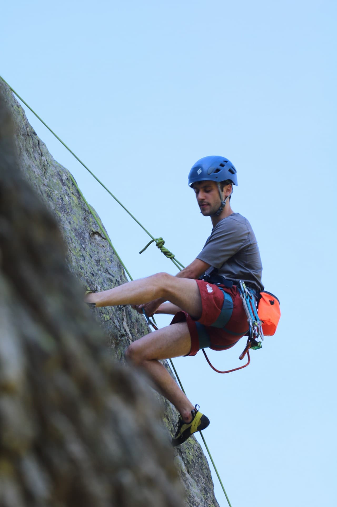
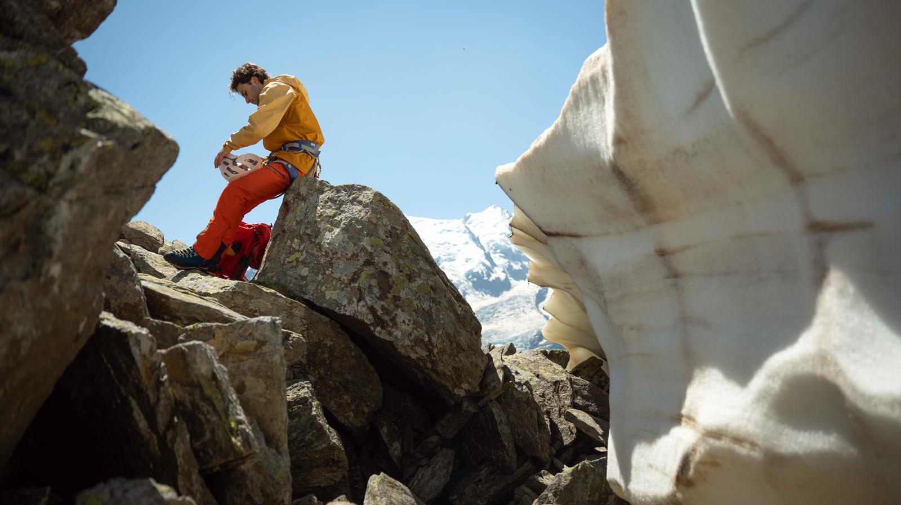

## Beyond research

While my [[index|home page]] focuses on my academic path and scientific interests, this page is a glimpse into who I am outside the lab.
I believe that a balanced life fuels better research.

## Outside the lab

I am an avid climber. Navigating a glacier or a rock face requires a type of focus and strategic planning that often complements my scientific work.

  
  
<em>Climbing at <a href="https://climbingaway.fr/fr/site-escalade/le-capucin-mont-dore" target="_blank">Le Capucin</a>, Auvergne. (Courtesy of Alexis Volant)</em>

 

  
  
<em>Gearing up on the Mer de Glace glacier, Chamonix. (Courtesy of William Sandot-Banet)</em>

