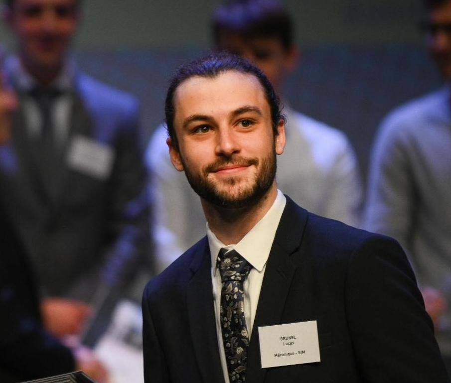

Hi, I'm Lucas Brunel. I am a final-year PhD candidate in Applied Mathematics at ONERA and LIMOS.

My work focuses on uncertainty propagation using surrogate models with functional outputs. I am particularly interested in random sets, Bayesian modelling and dimensionality reduction.

I am currently looking for a postdoctoral position starting in March 2026.

## Explore my work

- [[Research]]: An overview of my publications and current projects
- [[Teaching]]: My experience as a teaching assistant and mentor
- [[CV]]: My full academic curriculum vitæ

## Get in touch

You can find my full publication list on [Google Scholar](https://scholar.google.com/citations?user=xVmgfVgAAAAJ&hl=fr) or connect with me on [LinkedIn](https://www.linkedin.com/in/lucas-brunel-/).

If you would like to discuss potential collaborations or opportunities, feel free to contact me by [email](mai&#108;to&#58;%&#54;Cu%&#54;&#51;a%73&#46;&#98;%&#55;2&#37;75nel&#37;40&#111;u&#37;74&#108;&#111;ok%2Efr).
